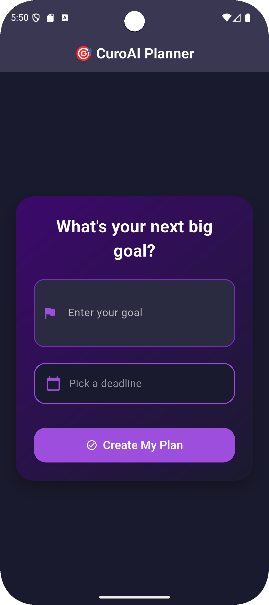

# 🎯 CuroAI Goal Planner

**CuroAI** is a beautifully designed, dark-themed Flutter app that lets users submit their personal goals along with a deadline. The goal is stored via a simple HTTP POST request, simulating a real-world backend connection.

---

## ✨ Features

- 🖊️ Add a goal with custom text
- 📅 Pick a deadline using an intuitive date picker
- 🌑 Stylish and modern dark UI with deep purple tones
- 📤 Submit your goal to a server (simulated with Beeceptor)
- ✅ Feedback using snackbars (success or error messages)
- 🧠 Built with user-friendliness and sleek design in mind

---

## 🧪 Screenshots

| Goal Submission UI | 
|--------------------|
|  | 

---

### Prerequisites

- Flutter SDK (3.0+ recommended)
- Dart SDK
- Android Studio / VS Code
- Emulator or Physical Device

